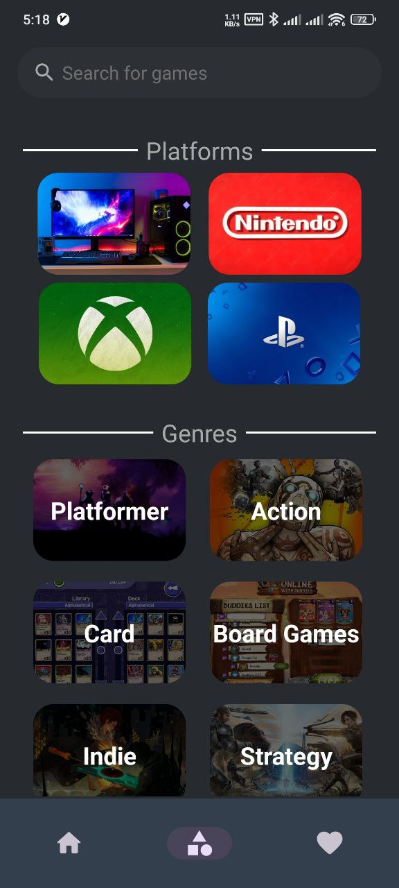

# Wiki Games

Wiki Games is a an android app that show and inform user about a vast majorities of Video Games and theri related information like their platforms, on which stores can get them, screen shots and related games and etc.

It has been developed by Kotlin and latest methods of android development and also applies MVP as its Architecture and use RX3 libraries to implement Reactive Programming.
## Tech Stack

**Reactive Programming:** RXJava3, RXBinding, Kotlin Coroutines

**UI:** XML Views

**Networking:** Retrofit, GSON, Coil

**Dependency Injecttion:** Hilt

**Database:** Room

**Paginition:** Paging3
## Lessons Learned

In development process i have faced many difficulties as it was my first experince to using RX libariries suh as:

**1. getting a game desscription when it is not in Details Screen:**

The api that used for Wiki Games does not give a game description in responses that are a list of games and somehow i had to call an Rroute for every game in a list response (e.g A list of Racing games) and add it's description to mapped games in the list.

the soloution of this problem was to convert each games in my response list to and individual Observable object, call the details route for that games and emit it again as a list.

**2. Using Paging3 with RX:**

Typically this isn't a problem but for the first experince working with RX there are some minor difficulties to manage PagingSources, presenters and contracts.

**3. Calling differents api route and showing them on same time:**

in the Home and Details Screen there are 3 different api route that are called sequential but in the UI each responsible UI element does not load data seperatly but the whole UI Load at same time, thanks to flatMap and map operators.
## Screenshots

**Home Screen**

**Search Screen**

**Games Screen**

**Details Screen**

**Favorites Screen**

